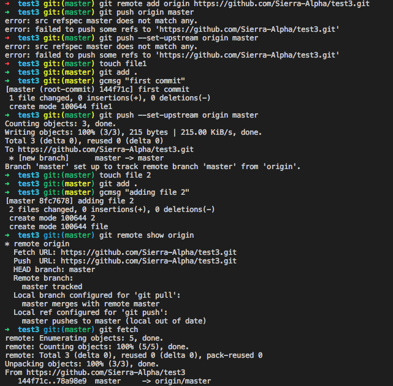
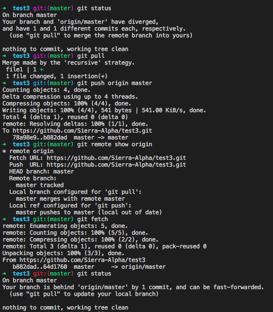

# ZSH_Custom

Just my custom Zsh settings to get a nice looking terminal prompt.

if you load the files into your '.oh-my-zsh/custom' folder you'll have the same beautiful prompt

syntax = 'git:( BRANCH )'

'git:(' and ')' are the ZSH_THEME_GIT_PROMPT_PREFIX and the ZSH_THEME_GIT_PROMPT_SUFFIX respectivly, referred to as 'git:( + )' from now on (as the prefix and suffix are always a matching color)

BRANCH is the current branch checked out

Color Meaning:

BRANCH:

  Green   = Nothing to commit and working tree is clean
  Yellow  = Untracked, not staged files present, add and commit to get to BRANCH = green

'git:( + )':

  Green   = Remote exists and is same as local
  Yellow  = Remote doesn't exist or hasnt been set with: git remote add origin https/some/url/here.git
  Magenta = Divergered state, some commits have been made locally and some have been made on remote seperatly (see note below)
  Cyan    = Local is ahead of tracked HEAD (not necesarrilly remote see note below)
  Red     = Local is ahead of tracked HEAD (not necesarrilly remote see note below)
  
Note:

  The tracked HEAD is local, to see remote status try 'git remote show origin', to get full functionality use 'git fetch' to    update local tracked HEAD to match remote, this will not overwrite local files but allow the functions for comparing to the remote to calculate correctly, this is smecific to the Magenta, Cyan and Red displays.
  
Below is a screen shot:

it shows the following pseudo steps:
  1.  Repository exists locally and on remote but is not yet set with the 'git add remote https/some/url/here' command
  2.  Shows the BRANCH colour changing based on the local working tree status
  3.  Equal remote and local,      clean working tree    (green and green)
  4.  Equal remote and local,      dirty working tree    (green and yellow)
  5.  Remote behind local,         clean working tree    (blue and green)
  6.  In the mean time I added some files directly to the remote, you can see this in the output from 'git remote show origin'
  7.  Used fetch to update the tracked HEAD to match the remote
  8.  Diverged remote and local,   clean working tree    (magenta and green)
  9.  Pull down remote changes, now local is ahead of remote
  10. Remote behind local,         clean working tree    (blue and green)
  11. Equal remote and local,      clean working tree    (green and green)
  12. Changed some files only on the remote,  you can see this in the output from 'git remote show origin'
  13. Used fetch to update the tracked HEAD to match the remote
  14. Remote ahead of local,       clean working tree    (red and green)
  15. 'git pull'
  16. Equal remote and local,      clean working tree    (green and green) - "Ahh thats better, whew" - Shaun
